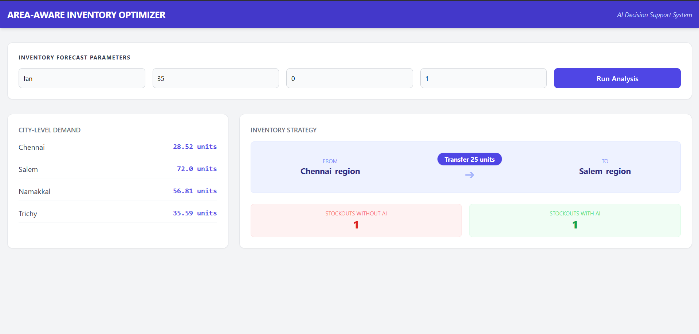
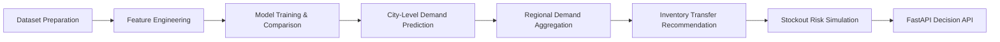

# Area-Aware Demand Forecasting and Inventory Pre-Positioning System


## Project Overview

This project builds an **AI-driven logistics decision support system** for e-commerce inventory management.

Instead of forecasting demand for an entire region, the system predicts **city-level product demand** and recommends **inventory transfers between regional warehouses** to reduce stockouts and improve delivery efficiency.

The system demonstrates how **machine learning predictions can be integrated with operational logistics decisions**.


> [!IMPORTANT]  
> This project focuses not only on demand forecasting but also on **inventory decision-making**, showing how machine learning can help redistribute stock between warehouses to reduce stockouts.


---

# System Interface


Below is the dashboard showing **city-level demand predictions and recommended inventory transfers**.




---

# Problem Statement


E-commerce platforms typically maintain centralized warehouses. However, **demand varies significantly across cities** due to:

- regional economic activity  
- seasonal weather patterns  
- festivals and holidays  
- consumer purchasing behavior  


Poor inventory distribution can lead to:

- stockouts in high-demand cities  
- excess inventory in low-demand areas  
- delayed deliveries  


This project proposes a system that:

1. predicts **city-level demand**
2. aggregates demand **regionally**
3. recommends **inventory transfers**
4. evaluates **stockout risk reduction**


---

# System Workflow





---

# Dataset


The project starts with a retail sales dataset and converts it into a **logistics forecasting dataset**.

### Original Dataset Fields

- date  
- store  
- item  
- sales  


### Processed Dataset Features

- city  
- product  
- units_sold  
- month  
- day_of_week  
- temperature  
- rain  
- is_festival  


Additional contextual features simulate **real-world demand drivers** such as weather and seasonal demand patterns.


---

# Machine Learning Models


Multiple regression models are trained and compared.

| Model | Purpose |
|------|------|
| Linear Regression | Baseline forecasting model |
| Random Forest | Captures non-linear demand patterns |
| Gradient Boosting | Improves prediction accuracy |


### Evaluation Metric

```
Mean Absolute Error (MAE)
```


The model with the **lowest MAE** is automatically selected.


---

# Uncertainty Estimation


Demand predictions include **uncertainty ranges** using quantile regression.

Models trained:

- 10th percentile model  
- 50th percentile model  
- 90th percentile model  


Example output:

```
Predicted Demand: 80 units
Demand Range: 60 – 110 units
```


This allows planners to **prepare inventory for demand fluctuations**.


---

# Regional Inventory Optimization


Cities are grouped into logistics regions.

### Salem Region

- Salem  
- Namakkal  


### Chennai Region

- Chennai  
- Trichy  


The system:

1. predicts demand per city  
2. aggregates regional demand  
3. detects supply imbalance  
4. recommends inventory transfers  


Example result:

```
City Demand Forecast

Chennai   : 28 units
Salem     : 72 units
Namakkal  : 56 units
Trichy    : 35 units


Regional Demand

Salem Region   : 128 units
Chennai Region : 64 units


Recommended Action

Move 25 units from Chennai warehouse to Salem warehouse
```


---

# Stockout Risk Simulation


To evaluate the decision system, two scenarios are simulated.

### Scenario 1 — Without AI

Inventory remains fixed at initial arbitrary levels.


### Scenario 2 — With AI

Initial warehouse inventory is randomized to introduce supply volatility, and the system dynamically computes and executes optimal stock transfers between regions to prevent shortages.


Example result (over 1000 simulated volatile supply runs):

```text
Stockouts without system : 807
Stockouts with system    : 373
```


This shows how **inventory repositioning reduces stockout risk**.


---

# API Deployment


The project exposes a **FastAPI decision service** for real-time predictions.


### API Endpoint

```
/decision
```


### Example Request

```
/decision?product=Fan&temperature=32&rain=0&festival=1
```


### Example Response

```json
{
  "city_predictions": {
    "Chennai": 28.52,
    "Salem": 72,
    "Namakkal": 56.81,
    "Trichy": 35.59
  },
  "recommended_transfer": {
    "from": "Chennai_region",
    "to": "Salem_region",
    "units": 25
  },
  "stockout_analysis": {
    "without_system": 1,
    "with_system": 0
  }
}
```


---

# Features


| Feature | Description |
|------|------|
| City-Level Forecasting | Predicts product demand for individual cities |
| Model Comparison | Trains and compares multiple ML models |
| Uncertainty Estimation | Quantile regression predicts demand ranges |
| Regional Aggregation | Combines city demand into regional demand |
| Inventory Transfer Logic | Recommends stock movement between warehouses |
| Stockout Simulation | Evaluates stockout risk reduction |
| FastAPI Deployment | Provides real-time prediction API |


---

# Technologies Used


- Python  
- Scikit-learn  
- FastAPI  
- Pandas  
- NumPy  
- Matplotlib  


---

# Project Structure


```
AreaAwareDemandForecasting
│
├── images
│   └── dashboard.png
│
├── data
│   └── real_sales.csv
│
├── src
│   ├── api.py
│   ├── prepare_real_data.py
│   ├── train_model.py
│   ├── regional_inventory_optimizer.py
│   ├── city_inventory_optimizer.py
│   ├── advanced_stockout_simulation.py
│   ├── stockout_simulation.py
│   └── visualize_demand.py
│
├── README.md
└── requirements.txt
```


---

# Running the Project


Clone the repository

```bash
git clone https://github.com/lishanthss/area-aware-demand-forecasting-and-inventory-prepositioning.git
```


Move into the project directory

```bash
cd area-aware-demand-forecasting
```


Install dependencies

```bash
pip install -r requirements.txt
```


Prepare dataset

```bash
python src/prepare_real_data.py
```


Train machine learning models

```bash
python src/train_model.py
```


Start the API server

```bash
python -m uvicorn src.api:app --reload
```


Open API documentation

```bash
http://127.0.0.1:8000/docs
```
